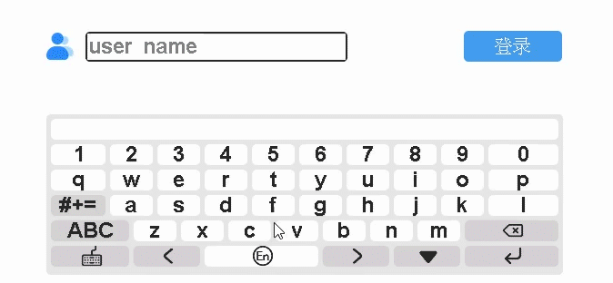

 

    

 

  <a><b>致力于低代码开发，多功能，易用的免费嵌入式图形库</b></a>

---

    

 

    <a href="https://www.hmi.gaotongfont.cn/kfgj"
    > 公司官网 </a> |
    <a href="https://space.bilibili.com/3493293474188211/video"
    > B 站教程 </a> |
    <a href="https://www.hmi.gaotongfont.cn/kfgj#/#hmiEngine"
    > Engine 使用手册 </a> |
    <a href="https://www.hmi.gaotongfont.cn/kfgj#/#hmidesigner"
    > Designer 使用手册 </a> |
    <a href="http://isite.baidu.com/site/wjz7qkrv/406a2b0c-f9c7-4a08-a47a-662e862b2af4?ch=48&wid=498ccd5c05334f21a2142ba3cf628964_0_0&field=&orderBy=&categoryId=undefined&title=%E8%81%94%E7%B3%BB%E6%88%91%E4%BB%AC"
    > 联系方式 </a> |
    <a href="https://qun.qq.com/qqweb/qunpro/share?_wv=3&_wwv=128&appChannel=share&inviteCode=20igkt2UZnY&businessType=9&from=181074&biz=ka&mainSourceId=share&subSourceId=others&jumpsource=shorturl#/pc"
    > QQ频道 </a>

 

## :bookmark_tabs:  **介绍**

 

&nbsp;&nbsp;&nbsp;&nbsp;&nbsp;&nbsp;&nbsp;&nbsp;<b>GT-HMI ：</b>  专为国内嵌入式 UI 设计开发打造的免费神器！

        GT-HMI（Human Machine Interface） 国产开源 GUI 框架及永久免费设计软件。它提供创建具有易于使用的图形元素，精美的视觉效果和低内存占用的嵌入式 GUI 所需的一切。针对国内市场及用户需求，使用习惯进行了优化设计，为国内工程师量身打造！

&nbsp;&nbsp;&nbsp;&nbsp;&nbsp;&nbsp;&nbsp;&nbsp;产品由中国高通 GENITOP 倾心打造，继承了中国高通 30 年的汉显技术及汉字技术积累。产品分为上位机 GT-HMI Designer 和下位机 GT-HMI Engine。

 

## :microscope:  **特性**

 

<ul>
<li style="margin-bottom: 4px;">上位机设计软件 GT-HMI Designer 永久免费，下位机技术框架 GT-HMI Engine 开源，使用无拘束；</li>
<li style="margin-bottom: 4px;">GT-HMI Designer 内嵌下位机技术框架编译器，可自动生成下位机代码；</li>
<li style="margin-bottom: 4px;">提供 GT-HMI 模块，已适配 GT-HMI 上下位机软件及驱动，可以用于前期开发调试，也可以直接作为显示模块使用；</li>
<li style="margin-bottom: 4px;">多平台兼容，移植便捷；</li>
<li style="margin-bottom: 4px;">上位机设计软件 GT-HMI Designer；</li>
<li style="margin-bottom: 4px;">可直接生成交互代码，免去写代码的繁琐工作；</li>
<li style="margin-bottom: 4px;">模拟器仿真即见即所得；</li>
<li style="margin-bottom: 4px;">内置了大量常用的组件，如按钮、文本框、进度条、单选框等；</li>
<li style="margin-bottom: 4px;">支持高通全系列点阵/矢量字库，支持中外文及小语种，多种字号及字体；</li>
<li style="margin-bottom: 4px;">内置中英文及数字输入法；</li>
<li style="margin-bottom: 4px;">持续更新的 GUI 示例库和 UI 资源库；</li>
<li style="margin-bottom: 4px;">下位机技术框架 GT-HMI Engine；</li>
<li style="margin-bottom: 4px;">纯 C 语言编写，使用无门槛；</li>
<li style="margin-bottom: 4px;">小巧高效，不限平台，最小仅需 24K RAM+32K FLASH，可运行在 Cortex-ARM M0\M3 等小资源平台；</li>
<li style="margin-bottom: 4px;">移植便捷，切换平台只需移植定时器、TP 和 LCD 接口，并提供移植教程及示例；</li>
<li style="margin-bottom: 4px;">丰富详实的例程，配套的开发套件易于上手；</li>
<li style="margin-bottom: 4px;">支持自定义功能开发，可用 GT-HMI Engine 自定义控件和功能，组合进 GT-HMI Designer 生成的标准代码；</li>
<li style="margin-bottom: 4px;">带系统（如 RTOS、Linux 等）和裸机均可使用。</li>
</ul>

 

## :hammer_and_wrench:  **软件架构**

 

**软件架构说明**

<table>
 <tr>
  <th style="width:40%">目录</th>
  <th style="width:60%">说明</th>
 </tr>
 <tr>
  <td>doc/</td>
  <td>相关文档说明资料</td>
 </tr>
 <tr>
  <td>driver/</td>
  <td>底层驱动相关的移植代码</td>
 </tr>
 <tr>
  <td>examples/</td>
  <td>控件调用示例</td>
 </tr>
 <tr>
  <td>sources/</td>
  <td>gui 内部使用的 images 素材&nbsp;&nbsp;&nbsp;&nbsp;&nbsp;&nbsp;&nbsp;&nbsp;&nbsp;&nbsp;&nbsp;&nbsp;&nbsp;&nbsp;&nbsp;&nbsp;&nbsp;&nbsp;&nbsp;&nbsp;&nbsp;&nbsp;&nbsp;&nbsp;&nbsp;&nbsp;&nbsp;&nbsp;&nbsp;&nbsp;&nbsp;&nbsp;&nbsp;&nbsp;&nbsp;</td>
 </tr>
 <tr>
  <td>test/</td>
  <td>单元测试代码</td>
 </tr>
 <tr>
  <td>src/</td>
  <td>gui 框架代码</td>
 </tr>
 <tr>
  <td>|-gt_conf.h</td>
  <td>配置</td>
 </tr>
 <tr>
  <td>|-core/</td>
  <td>gui 核心代码</td>
 </tr>
 <tr>
  <td>|-extra/</td>
  <td>拓展控件</td>
 </tr>
 <tr>
  <td>|-font/</td>
  <td>字体</td>
 </tr>
 <tr>
  <td>|-hal/</td>
  <td>中间件，中间层</td>
 </tr>
 <tr>
  <td>|-others/</td>
  <td>不好分类的代码</td>
 </tr>
 <tr>
  <td>|-utils/</td>
  <td>工具类</td>
 </tr>
 <tr>
  <td>|-widgets/</td>
  <td>控件</td>
 </tr>
 <tr>
  <td>|-|-gt_conf_widgets.h&nbsp;&nbsp;&nbsp;&nbsp;&nbsp;&nbsp;&nbsp;&nbsp;&nbsp;&nbsp;&nbsp;&nbsp;&nbsp;&nbsp;&nbsp;&nbsp;&nbsp;&nbsp;&nbsp;&nbsp;&nbsp;&nbsp;</td>
  <td>控件开关宏&nbsp;</td>
 </tr>
</table>

 

## :movie_camera: **演示示例**

 

:link: **多国语言示例**

 

    

C code

<pre><code style="color:black;">
#include "gt_ui.h"

// screen_home
gt_obj_st * screen_home = NULL;
static gt_obj_st * lab1 = NULL;
static gt_obj_st * rect1 = NULL;
static gt_obj_st * btn1 = NULL;
static gt_obj_st * btn2 = NULL;
static gt_obj_st * btn3 = NULL;
static gt_obj_st * btn4 = NULL;
static gt_obj_st * btn5 = NULL;
static gt_obj_st * btn7 = NULL;
static gt_obj_st * btn8 = NULL;
static gt_obj_st * btn9 = NULL;
static gt_obj_st * btn10 = NULL;

static void btn1_0_cb(gt_event_st * e) {
    gt_init_screen_1();
}

static void btn2_0_cb(gt_event_st * e) {
    gt_init_screen_2();
}

static void btn3_0_cb(gt_event_st * e) {
    gt_init_screen_3();
}

static void btn4_0_cb(gt_event_st * e) {
    gt_init_screen_4();
}

static void btn5_0_cb(gt_event_st * e) {
    gt_init_screen_5();
}

static void btn7_0_cb(gt_event_st * e) {
    gt_init_screen_7();
}

static void btn8_0_cb(gt_event_st * e) {
    gt_init_screen_8();
}

static void btn9_0_cb(gt_event_st * e) {
    gt_init_screen_9();
}

static void btn10_0_cb(gt_event_st * e) {
    gt_init_screen_10();
}

void gt_init_screen_home(void)
{
    screen_home = gt_obj_create(NULL);
    gt_screen_set_bgcolor(screen_home, gt_color_hex(0xFFFFFF));
    // lab1
    lab1 = gt_label_create(screen_home);
    gt_obj_set_pos(lab1, 295, 16);
    gt_obj_set_size(lab1, 118, 40);
    gt_label_set_font_color(lab1, gt_color_hex(0x000000));
    gt_label_set_font_size(lab1, 24);
    gt_label_set_font_family_cn(lab1, 16);
    gt_label_set_font_align(lab1, GT_ALIGN_LEFT);
    gt_label_set_text(lab1, "语言设置");
    // rect1
    rect1 = gt_rect_create(screen_home);
    gt_obj_set_pos(rect1, 8, 55);
    gt_obj_set_size(rect1, 660, 1);
    gt_rect_set_radius(rect1, 0);
    gt_rect_set_bg_color(rect1, gt_color_hex(0xdbdbdb));
    gt_rect_set_color_border(rect1, gt_color_hex(0xdbdbdb));
    gt_rect_set_fill(rect1, 1);
    gt_rect_set_border(rect1, 0);
    // btn1
    btn1 = gt_btn_create(screen_home);
    gt_obj_set_pos(btn1, 29, 76);
    gt_obj_set_size(btn1, 160, 43);
    gt_btn_set_font_color(btn1, gt_color_hex(0x000000));
    gt_btn_set_font_size(btn1, 24);
    gt_btn_set_font_family_cn(btn1, 16);
    gt_btn_set_font_family_en(btn1, 84);
    gt_btn_set_font_align(btn1, GT_ALIGN_CENTER_MID);
    gt_btn_set_space(btn1, 5, 0);
    gt_btn_set_font_thick_en(btn1, 30);
    gt_btn_set_font_thick_cn(btn1, 30);
    gt_btn_set_font_gray(btn1, 1);
    gt_btn_set_text(btn1, "中文");
    gt_btn_set_color_background(btn1, gt_color_hex(0xddeeff));
    gt_btn_set_radius(btn1, 8);
    gt_obj_add_event_cb(btn1, btn1_0_cb, GT_EVENT_TYPE_INPUT_RELEASED, NULL);
    // btn2
    btn2 = gt_btn_create(screen_home);
    gt_obj_set_pos(btn2, 264, 76);
    gt_obj_set_size(btn2, 160, 43);
    gt_btn_set_font_color(btn2, gt_color_hex(0x000000));
    gt_btn_set_font_size(btn2, 24);
    gt_btn_set_font_family_cn(btn2, 16);
    gt_btn_set_font_family_en(btn2, 84);
    gt_btn_set_font_align(btn2, GT_ALIGN_CENTER_MID);
    gt_btn_set_space(btn2, 5, 0);
    gt_btn_set_font_thick_en(btn2, 30);
    gt_btn_set_font_thick_cn(btn2, 30);
    gt_btn_set_font_gray(btn2, 1);
    gt_btn_set_text(btn2, "日语");
    gt_btn_set_color_background(btn2, gt_color_hex(0xddeeff));
    gt_btn_set_radius(btn2, 8);
    gt_obj_add_event_cb(btn2, btn2_0_cb, GT_EVENT_TYPE_INPUT_RELEASED, NULL);
    // btn3
    btn3 = gt_btn_create(screen_home);
    gt_obj_set_pos(btn3, 489, 76);
    gt_obj_set_size(btn3, 160, 41);
    gt_btn_set_font_color(btn3, gt_color_hex(0x000000));
    gt_btn_set_font_size(btn3, 24);
    gt_btn_set_font_family_cn(btn3, 16);
    gt_btn_set_font_family_en(btn3, 84);
    gt_btn_set_font_align(btn3, GT_ALIGN_CENTER_MID);
    gt_btn_set_space(btn3, 5, 0);
    gt_btn_set_font_thick_en(btn3, 30);
    gt_btn_set_font_thick_cn(btn3, 30);
    gt_btn_set_font_gray(btn3, 1);
    gt_btn_set_text(btn3, "韩语");
    gt_btn_set_color_background(btn3, gt_color_hex(0xddeeff));
    gt_btn_set_radius(btn3, 8);
    gt_obj_add_event_cb(btn3, btn3_0_cb, GT_EVENT_TYPE_INPUT_RELEASED, NULL);
    // btn4
    btn4 = gt_btn_create(screen_home);
    gt_obj_set_pos(btn4, 29, 158);
    gt_obj_set_size(btn4, 160, 43);
    gt_btn_set_font_color(btn4, gt_color_hex(0x000000));
    gt_btn_set_font_size(btn4, 24);
    gt_btn_set_font_family_cn(btn4, 16);
    gt_btn_set_font_family_en(btn4, 41);
    gt_btn_set_font_align(btn4, GT_ALIGN_CENTER_MID);
    gt_btn_set_space(btn4, 5, 0);
    gt_btn_set_text(btn4, "英语");
    gt_btn_set_color_background(btn4, gt_color_hex(0xddeeff));
    gt_btn_set_radius(btn4, 8);
    gt_obj_add_event_cb(btn4, btn4_0_cb, GT_EVENT_TYPE_INPUT_RELEASED, NULL);

    // btn5
    btn5 = gt_btn_create(screen_home);
    gt_obj_set_pos(btn5, 263, 158);
    gt_obj_set_size(btn5, 160, 43);
    gt_btn_set_font_color(btn5, gt_color_hex(0x000000));
    gt_btn_set_font_size(btn5, 24);
    gt_btn_set_font_family_cn(btn5, 16);
    gt_btn_set_font_family_en(btn5, 53);
    gt_btn_set_font_align(btn5, GT_ALIGN_CENTER_MID);
    gt_btn_set_space(btn5, 5, 0);
    gt_btn_set_text(btn5, "法语");
    gt_btn_set_color_background(btn5, gt_color_hex(0xddeeff));
    gt_btn_set_radius(btn5, 8);
    gt_obj_add_event_cb(btn5, btn5_0_cb, GT_EVENT_TYPE_INPUT_RELEASED, NULL);

    // btn7
    btn7 = gt_btn_create(screen_home);
    gt_obj_set_pos(btn7, 30, 238);
    gt_obj_set_size(btn7, 160, 43);
    gt_btn_set_font_color(btn7, gt_color_hex(0x000000));
    gt_btn_set_font_size(btn7, 24);
    gt_btn_set_font_family_cn(btn7, 16);
    gt_btn_set_font_family_en(btn7, 53);
    gt_btn_set_font_align(btn7, GT_ALIGN_CENTER_MID);
    gt_btn_set_space(btn7, 5, 0);
    gt_btn_set_text(btn7, "西班牙语");
    gt_btn_set_color_background(btn7, gt_color_hex(0xddeeff));
    gt_btn_set_radius(btn7, 8);
    gt_obj_add_event_cb(btn7, btn7_0_cb, GT_EVENT_TYPE_INPUT_RELEASED, NULL);

    // btn8
    btn8 = gt_btn_create(screen_home);
    gt_obj_set_pos(btn8, 263, 238);
    gt_obj_set_size(btn8, 160, 43);
    gt_btn_set_font_color(btn8, gt_color_hex(0x000000));
    gt_btn_set_font_size(btn8, 24);
    gt_btn_set_font_family_cn(btn8, 16);
    gt_btn_set_font_family_en(btn8, 41);
    gt_btn_set_font_align(btn8, GT_ALIGN_CENTER_MID);
    gt_btn_set_space(btn8, 5, 0);
    gt_btn_set_text(btn8, "泰语");
    gt_btn_set_color_background(btn8, gt_color_hex(0xddeeff));
    gt_btn_set_radius(btn8, 8);
    gt_obj_add_event_cb(btn8, btn8_0_cb, GT_EVENT_TYPE_INPUT_RELEASED, NULL);

    // btn9
    btn9 = gt_btn_create(screen_home);
    gt_obj_set_pos(btn9, 490, 238);
    gt_obj_set_size(btn9, 160, 43);
    gt_btn_set_font_color(btn9, gt_color_hex(0x000000));
    gt_btn_set_font_size(btn9, 24);
    gt_btn_set_font_family_cn(btn9, 16);
    gt_btn_set_font_family_en(btn9, 75);
    gt_btn_set_font_align(btn9, GT_ALIGN_CENTER_MID);
    gt_btn_set_space(btn9, 5, 0);
    gt_btn_set_text(btn9, "阿拉伯语");
    gt_btn_set_color_background(btn9, gt_color_hex(0xddeeff));
    gt_btn_set_radius(btn9, 8);
    gt_obj_add_event_cb(btn9, btn9_0_cb, GT_EVENT_TYPE_INPUT_RELEASED, NULL);

    // btn10
    btn10 = gt_btn_create(screen_home);
    gt_obj_set_pos(btn10, 489, 158);
    gt_obj_set_size(btn10, 160, 43);
    gt_btn_set_font_color(btn10, gt_color_hex(0x000000));
    gt_btn_set_font_size(btn10, 24);
    gt_btn_set_font_family_cn(btn10, 16);
    gt_btn_set_font_family_en(btn10, 60);
    gt_btn_set_font_align(btn10, GT_ALIGN_CENTER_MID);
    gt_btn_set_space(btn10, 5, 0);
    gt_btn_set_text(btn10, "俄语");
    gt_btn_set_color_background(btn10, gt_color_hex(0xddeeff));
    gt_btn_set_radius(btn10, 8);
    gt_obj_add_event_cb(btn10, btn10_0_cb, GT_EVENT_TYPE_INPUT_RELEASED, NULL);

    gt_disp_load_scr_anim(screen_home, GT_SCR_ANIM_TYPE_NONE, 500, 0, true);

}
</code></pre>

 

 

:link:**矢量字库示例**

 

    

C code

<pre><code style="color:black;">
#include "gt_ui.h"

// screen_home
gt_obj_st * screen_home = NULL;
static gt_obj_st * lab1 = NULL;
static gt_obj_st * rect1 = NULL;
static gt_obj_st * btn1 = NULL;
static gt_obj_st * btn2 = NULL;
static gt_obj_st * btn3 = NULL;
static gt_obj_st * btn4 = NULL;
static gt_obj_st * btn5 = NULL;
static gt_obj_st * btn7 = NULL;
static gt_obj_st * btn8 = NULL;
static gt_obj_st * btn9 = NULL;
static gt_obj_st * btn10 = NULL;

static void btn1_0_cb(gt_event_st * e) {
    gt_init_screen_1();
}

static void btn2_0_cb(gt_event_st * e) {
    gt_init_screen_2();
}

static void btn3_0_cb(gt_event_st * e) {
    gt_init_screen_3();
}

static void btn4_0_cb(gt_event_st * e) {
    gt_init_screen_4();
}

static void btn5_0_cb(gt_event_st * e) {
    gt_init_screen_5();
}

static void btn7_0_cb(gt_event_st * e) {
    gt_init_screen_7();
}

static void btn8_0_cb(gt_event_st * e) {
    gt_init_screen_8();
}

static void btn9_0_cb(gt_event_st * e) {
    gt_init_screen_9();
}

static void btn10_0_cb(gt_event_st * e) {
    gt_init_screen_6();
}

void gt_init_screen_home(void)
{
    screen_home = gt_obj_create(NULL);
    gt_screen_set_bgcolor(screen_home, gt_color_hex(0xFFFFFF));
    // lab1
    lab1 = gt_label_create(screen_home);
    gt_obj_set_pos(lab1, 207, 10);
    gt_obj_set_size(lab1, 309, 40);
    gt_label_set_font_color(lab1, gt_color_hex(0x000000));
    gt_label_set_font_size(lab1, 24);
    gt_label_set_font_family_cn(lab1, 80);
    gt_label_set_font_align(lab1, GT_ALIGN_LEFT);
    gt_label_set_font_thick_en(lab1, 30);
    gt_label_set_font_thick_cn(lab1, 30);
    gt_label_set_font_gray(lab1, 4);
    gt_label_set_text(lab1, "矢量字库，灰度与多字形");
    // rect1
    rect1 = gt_rect_create(screen_home);
    gt_obj_set_pos(rect1, 8, 55);
    gt_obj_set_size(rect1, 660, 1);
    gt_rect_set_radius(rect1, 0);
    gt_rect_set_bg_color(rect1, gt_color_hex(0xdbdbdb));
    gt_rect_set_color_border(rect1, gt_color_hex(0xdbdbdb));
    gt_rect_set_fill(rect1, 1);
    gt_rect_set_border(rect1, 0);
    // btn1
    btn1 = gt_btn_create(screen_home);
    gt_obj_set_pos(btn1, 33, 78);
    gt_obj_set_size(btn1, 160, 43);
    gt_btn_set_font_color(btn1, gt_color_hex(0x000000));
    gt_btn_set_font_size(btn1, 24);
    gt_btn_set_font_family_cn(btn1, 80);
    gt_btn_set_font_family_en(btn1, 84);
    gt_btn_set_font_align(btn1, GT_ALIGN_CENTER_MID);
    gt_btn_set_space(btn1, 0, 0);
    gt_btn_set_font_thick_en(btn1, 30);
    gt_btn_set_font_thick_cn(btn1, 30);
    gt_btn_set_font_gray(btn1, 4);
    gt_btn_set_text(btn1, "中文宋体");
    gt_btn_set_color_background(btn1, gt_color_hex(0xddeeff));
    gt_btn_set_radius(btn1, 8);
    gt_obj_add_event_cb(btn1, btn1_0_cb, GT_EVENT_TYPE_INPUT_RELEASED, NULL);
    // btn2
    btn2 = gt_btn_create(screen_home);
    gt_obj_set_pos(btn2, 266, 76);
    gt_obj_set_size(btn2, 160, 43);
    gt_btn_set_font_color(btn2, gt_color_hex(0x000000));
    gt_btn_set_font_size(btn2, 24);
    gt_btn_set_font_family_cn(btn2, 80);
    gt_btn_set_font_family_en(btn2, 84);
    gt_btn_set_font_align(btn2, GT_ALIGN_CENTER_MID);
    gt_btn_set_space(btn2, 0, 0);
    gt_btn_set_font_thick_en(btn2, 30);
    gt_btn_set_font_thick_cn(btn2, 30);
    gt_btn_set_font_gray(btn2, 4);
    gt_btn_set_text(btn2, "中文黑体");
    gt_btn_set_color_background(btn2, gt_color_hex(0xddeeff));
    gt_btn_set_radius(btn2, 8);
    gt_obj_add_event_cb(btn2, btn2_0_cb, GT_EVENT_TYPE_INPUT_RELEASED, NULL);
    // btn3
    btn3 = gt_btn_create(screen_home);
    gt_obj_set_pos(btn3, 493, 76);
    gt_obj_set_size(btn3, 160, 41);
    gt_btn_set_font_color(btn3, gt_color_hex(0x000000));
    gt_btn_set_font_size(btn3, 24);
    gt_btn_set_font_family_cn(btn3, 80);
    gt_btn_set_font_family_en(btn3, 84);
    gt_btn_set_font_align(btn3, GT_ALIGN_CENTER_MID);
    gt_btn_set_space(btn3, 0, 0);
    gt_btn_set_font_thick_en(btn3, 30);
    gt_btn_set_font_thick_cn(btn3, 30);
    gt_btn_set_font_gray(btn3, 4);
    gt_btn_set_text(btn3, "英文斜体");
    gt_btn_set_color_background(btn3, gt_color_hex(0xddeeff));
    gt_btn_set_radius(btn3, 8);
    gt_obj_add_event_cb(btn3, btn3_0_cb, GT_EVENT_TYPE_INPUT_RELEASED, NULL);
    // btn4
    btn4 = gt_btn_create(screen_home);
    gt_obj_set_pos(btn4, 33, 160);
    gt_obj_set_size(btn4, 160, 43);
    gt_btn_set_font_color(btn4, gt_color_hex(0x000000));
    gt_btn_set_font_size(btn4, 24);
    gt_btn_set_font_family_cn(btn4, 80);
    gt_btn_set_font_family_en(btn4, 41);
    gt_btn_set_font_align(btn4, GT_ALIGN_CENTER_MID);
    gt_btn_set_space(btn4, 0, 0);
    gt_btn_set_font_thick_en(btn4, 30);
    gt_btn_set_font_thick_cn(btn4, 30);
    gt_btn_set_font_gray(btn4, 4);
    gt_btn_set_text(btn4, "英文手写体");
    gt_btn_set_color_background(btn4, gt_color_hex(0xddeeff));
    gt_btn_set_radius(btn4, 8);
    gt_obj_add_event_cb(btn4, btn4_0_cb, GT_EVENT_TYPE_INPUT_RELEASED, NULL);

    // btn5
    btn5 = gt_btn_create(screen_home);
    gt_obj_set_pos(btn5, 265, 160);
    gt_obj_set_size(btn5, 160, 43);
    gt_btn_set_font_color(btn5, gt_color_hex(0x000000));
    gt_btn_set_font_size(btn5, 24);
    gt_btn_set_font_family_cn(btn5, 80);
    gt_btn_set_font_family_en(btn5, 53);
    gt_btn_set_font_align(btn5, GT_ALIGN_CENTER_MID);
    gt_btn_set_space(btn5, 0, 0);
    gt_btn_set_font_thick_en(btn5, 30);
    gt_btn_set_font_thick_cn(btn5, 30);
    gt_btn_set_font_gray(btn5, 4);
    gt_btn_set_text(btn5, "日文黑体");
    gt_btn_set_color_background(btn5, gt_color_hex(0xddeeff));
    gt_btn_set_radius(btn5, 8);
    gt_obj_add_event_cb(btn5, btn5_0_cb, GT_EVENT_TYPE_INPUT_RELEASED, NULL);

    // btn7
    btn7 = gt_btn_create(screen_home);
    gt_obj_set_pos(btn7, 32, 240);
    gt_obj_set_size(btn7, 160, 43);
    gt_btn_set_font_color(btn7, gt_color_hex(0x000000));
    gt_btn_set_font_size(btn7, 24);
    gt_btn_set_font_family_cn(btn7, 80);
    gt_btn_set_font_family_en(btn7, 53);
    gt_btn_set_font_align(btn7, GT_ALIGN_CENTER_MID);
    gt_btn_set_space(btn7, 0, 0);
    gt_btn_set_font_thick_en(btn7, 30);
    gt_btn_set_font_thick_cn(btn7, 30);
    gt_btn_set_font_gray(btn7, 4);
    gt_btn_set_text(btn7, "俄文");
    gt_btn_set_color_background(btn7, gt_color_hex(0xddeeff));
    gt_btn_set_radius(btn7, 8);
    gt_obj_add_event_cb(btn7, btn7_0_cb, GT_EVENT_TYPE_INPUT_RELEASED, NULL);

    // btn8
    btn8 = gt_btn_create(screen_home);
    gt_obj_set_pos(btn8, 267, 240);
    gt_obj_set_size(btn8, 160, 43);
    gt_btn_set_font_color(btn8, gt_color_hex(0x000000));
    gt_btn_set_font_size(btn8, 24);
    gt_btn_set_font_family_cn(btn8, 80);
    gt_btn_set_font_family_en(btn8, 41);
    gt_btn_set_font_align(btn8, GT_ALIGN_CENTER_MID);
    gt_btn_set_space(btn8, 0, 0);
    gt_btn_set_font_thick_en(btn8, 30);
    gt_btn_set_font_thick_cn(btn8, 30);
    gt_btn_set_font_gray(btn8, 4);
    gt_btn_set_text(btn8, "泰文");
    gt_btn_set_color_background(btn8, gt_color_hex(0xddeeff));
    gt_btn_set_radius(btn8, 8);
    gt_obj_add_event_cb(btn8, btn8_0_cb, GT_EVENT_TYPE_INPUT_RELEASED, NULL);

    // btn9
    btn9 = gt_btn_create(screen_home);
    gt_obj_set_pos(btn9, 494, 240);
    gt_obj_set_size(btn9, 160, 43);
    gt_btn_set_font_color(btn9, gt_color_hex(0x000000));
    gt_btn_set_font_size(btn9, 24);
    gt_btn_set_font_family_cn(btn9, 80);
    gt_btn_set_font_family_en(btn9, 75);
    gt_btn_set_font_align(btn9, GT_ALIGN_CENTER_MID);
    gt_btn_set_space(btn9, 0, 0);
    gt_btn_set_font_thick_en(btn9, 30);
    gt_btn_set_font_thick_cn(btn9, 30);
    gt_btn_set_font_gray(btn9, 4);
    gt_btn_set_text(btn9, "阿拉伯文");
    gt_btn_set_color_background(btn9, gt_color_hex(0xddeeff));
    gt_btn_set_radius(btn9, 8);
    gt_obj_add_event_cb(btn9, btn9_0_cb, GT_EVENT_TYPE_INPUT_RELEASED, NULL);

    // btn10
    btn10 = gt_btn_create(screen_home);
    gt_obj_set_pos(btn10, 495, 160);
    gt_obj_set_size(btn10, 160, 43);
    gt_btn_set_font_color(btn10, gt_color_hex(0x000000));
    gt_btn_set_font_size(btn10, 24);
    gt_btn_set_font_family_cn(btn10, 80);
    gt_btn_set_font_family_en(btn10, 60);
    gt_btn_set_font_align(btn10, GT_ALIGN_CENTER_MID);
    gt_btn_set_space(btn10, 0, 0);
    gt_btn_set_font_thick_en(btn10, 30);
    gt_btn_set_font_thick_cn(btn10, 30);
    gt_btn_set_font_gray(btn10, 4);
    gt_btn_set_text(btn10, "韩文黑体");
    gt_btn_set_color_background(btn10, gt_color_hex(0xddeeff));
    gt_btn_set_radius(btn10, 8);
    gt_obj_add_event_cb(btn10, btn10_0_cb, GT_EVENT_TYPE_INPUT_RELEASED, NULL);

    gt_disp_load_scr_anim(screen_home, GT_SCR_ANIM_TYPE_NONE, 500, 0, true);

}
</code></pre>

 

 

:link: **幻灯片示例动画**

 

    

C code

<pre><code style="color:black;">
#include "gt_ui.h"

// screen_home
gt_obj_st * screen_home = NULL;
static gt_obj_st * lab1 = NULL;
static gt_obj_st * img1 = NULL;
static gt_obj_st * player1 = NULL;
static gt_obj_st * svg1 = NULL;
static gt_obj_st * svg2 = NULL;

static void svg1_0_cb(gt_event_st * e) {
    gt_player_turn_prev(player1);
}

static void svg2_0_cb(gt_event_st * e) {
    gt_player_turn_next(player1);
}

void gt_init_screen_home(void)
{
    screen_home = gt_obj_create(NULL);
    gt_screen_set_bgcolor(screen_home, gt_color_hex(0xFFFFFF));
    // lab1
    lab1 = gt_label_create(screen_home);
    gt_obj_set_pos(lab1, 223, 71);
    gt_obj_set_size(lab1, 96, 51);
    gt_label_set_font_color(lab1, gt_color_hex(0x6e6e6e));
    gt_label_set_font_size(lab1, 32);
    gt_label_set_font_family_cn(lab1, 19);
    gt_label_set_font_align(lab1, GT_ALIGN_LEFT);
    gt_label_set_text(lab1, "风速");
    // img1
    img1 = gt_img_create(screen_home);
    gt_obj_set_pos(img1, 157, 75);
    gt_obj_set_size(img1, 42, 40);
    gt_img_set_src(img1, "f:img_42x40_9.png");
    // player1
    player1 = gt_player_create(screen_home);
    gt_obj_set_pos(player1, 153, 136);
    gt_obj_set_size(player1, 161, 66);
    gt_player_add_item(player1, "f:img_161x66_4.png", sizeof("f:img_161x66_4.png"));
    gt_player_add_item(player1, "f:img_161x66_5.png", sizeof("f:img_161x66_5.png"));
    gt_player_add_item(player1, "f:img_161x66_6.png", sizeof("f:img_161x66_6.png"));
    gt_player_add_item(player1, "f:img_161x66_7.png", sizeof("f:img_161x66_7.png"));
    gt_player_add_item(player1, "f:img_161x66_8.png", sizeof("f:img_161x66_8.png"));
    gt_player_set_type(player1, GT_PLAYER_TYPE_IMG);
    gt_player_set_mode(player1, GT_PLAYER_MODE_LOOP);
    /  svg1
    svg1 = gt_img_create(screen_home);
    gt_obj_set_pos(svg1, 76, 149);
    gt_obj_set_size(svg1, 48, 48);
    gt_img_set_src(svg1, "f:img_48x48_minus_0_3.png");
    gt_obj_add_event_cb(svg1, svg1_0_cb, GT_EVENT_TYPE_INPUT_RELEASED, NULL);
    // svg2
    svg2 = gt_img_create(screen_home);
    gt_obj_set_pos(svg2, 341, 148);
    gt_obj_set_size(svg2, 48, 48);
    gt_img_set_src(svg2, "f:img_48x48_plus_0_4.png");
    gt_obj_add_event_cb(svg2, svg2_0_cb, GT_EVENT_TYPE_INPUT_RELEASED, NULL);
    gt_disp_load_scr_anim(screen_home, GT_SCR_ANIM_TYPE_NONE, 500, 0, true);

}
</code></pre>

 

 

:link: **键盘控件示例动画**

 

    

C code

<pre><code style="color:black;">
#include "gt_ui.h"

// screen_home
gt_obj_st * screen_home = NULL;
static gt_obj_st * input1 = NULL;
static gt_obj_st * keyboard1 = NULL;

void gt_init_screen_home(void)
{
    screen_home = gt_obj_create(NULL);
    gt_screen_set_bgcolor(screen_home, gt_color_hex(0xFFFFFF));
    // input1
    input1 = gt_input_create(screen_home);
    gt_obj_set_pos(input1, 117, 38);
    gt_obj_set_size(input1, 249, 84);
    gt_input_set_font_color(input1, gt_color_hex(0x000000));
    gt_input_set_font_size(input1, 16);
    gt_input_set_font_family_cn(input1, 3);
    gt_input_set_font_family_en(input1, 39);
    gt_input_set_font_align(input1, GT_ALIGN_LEFT);
    gt_input_set_placeholder(input1, "placeholder");
    gt_input_set_bg_color(input1, gt_color_hex(0xffffff));
    // keyboard1
    keyboard1 = gt_keypad_create(screen_home);
    gt_obj_set_pos(keyboard1, 89, 138);
    gt_obj_set_size(keyboard1, 309, 170);
    gt_keypad_set_font_color(keyboard1, gt_color_hex(0xffffff));
    gt_keypad_set_font_size(keyboard1, 16);
    gt_keypad_set_font_align(keyboard1, GT_ALIGN_CENTER_MID);
    gt_keypad_set_color_background(keyboard1, gt_color_hex(0x242424));
    gt_keypad_set_target(keyboard1, input1);
    gt_disp_load_scr_anim(screen_home, GT_SCR_ANIM_TYPE_NONE, 500, 0, true);

}
</code></pre>

 

 

:link: **图片按钮控件示例动画**

 

    

C code

<pre><code style="color:black;">
#include "gt_ui.h"

/** screen_home */
gt_obj_st * screen_home = NULL;
static gt_obj_st * imgbtn1 = NULL;

void gt_init_screen_home(void)
{
    screen_home = gt_obj_create(NULL);
    gt_screen_set_bgcolor(screen_home, gt_color_hex(0xFFFFFF));
    /** imgbtn1 */
    imgbtn1 = gt_imgbtn_create(screen_home);
    gt_obj_set_pos(imgbtn1, 142, 136);
    gt_obj_set_size(imgbtn1, 185, 50);
    gt_imgbtn_set_src(imgbtn1, "f:img_185x50_10.png");
    gt_imgbtn_set_src_press(imgbtn1, "f:img_185x50_3.png");
    gt_disp_load_scr_anim(screen_home, GT_SCR_ANIM_TYPE_NONE, 500, 0, true);

}
</code></pre>

 

## :pushpin: **快速入门**

 

**Desinger功能特点**

        GT HMI Designer是一款功能强大的嵌入式人机界面设计软件。它提供直观的可视化设计界面，支持多种常用控件和丰富的交互功能。此外，它还支持多国语言界面设计和强大的仿真功能。通过GT HMI Designer，您可以轻松设计出美观、交互性强的界面，满足各种应用场景的需求。

**Desinger视频教程**

<ul>
<li style="margin-bottom: 4px;"><a href="https://www.bilibili.com/video/BV1Xm4y1h7vs/?spm_id_from=333.999.0.0&vd_source=8ecf13d60f5e8ce6a592b252d351e954">第一章 软件安装与工程创建</a></li>
<li style="margin-bottom: 4px;"><a href="https://www.bilibili.com/video/BV1va4y137ac/?spm_id_from=autoNext&vd_source=8ecf13d60f5e8ce6a592b252d351e954">第二章 简单工程的制作</a></li>
<li style="margin-bottom: 4px;"><a href="https://www.bilibili.com/video/BV1Uo4y1V7pg/?spm_id_from=333.999.0.0&vd_source=8ecf13d60f5e8ce6a592b252d351e954">第三章 控件介绍（上）</a></li>
<li style="margin-bottom: 4px;"><a href="https://www.bilibili.com/video/BV1fs4y1u7uz/?spm_id_from=333.999.0.0&vd_source=8ecf13d60f5e8ce6a592b252d351e954">第四章 控件介绍（下）</a></li>
<li style="margin-bottom: 4px;"><a href="https://www.bilibili.com/video/BV1Ds4y1B7iW/?spm_id_from=333.999.0.0&vd_source=8ecf13d60f5e8ce6a592b252d351e954">第五章 事件交互介绍</a></li>
</ul>

 

**Engine功能特点**

        GT HMI Engine是一款功能强大、高性能、多平台、多语言、稳定可靠的嵌入式人机界面引擎，提供丰富的控件和强大的交互功能。

**Engine 视频教程**

<ul>
<li style="margin-bottom: 4px;"><a href="https://www.bilibili.com/video/BV1Y24y1N7Bq/?spm_id_from=333.999.0.0&vd_source=8ecf13d60f5e8ce6a592b252d351e954">第六章 下位机工程移植</a></li>
<li style="margin-bottom: 4px;"><a href="https://www.bilibili.com/video/BV1Jh411c7jn/?spm_id_from=333.999.0.0&vd_source=8ecf13d60f5e8ce6a592b252d351e954">第七章 上下位机联动</a></li>
</ul>

 

